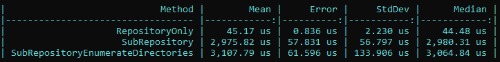

# Benchmark of find files in folder

It's just a sample of looking for xml files on top directory only versus all sub directories.

So if all xml files are separeted in a top directory, the result is almost 60x faster.

